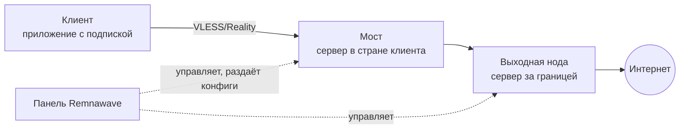

# Мост или нода с нуля — пошагово

Для тех, кто делает это впервые. Нужно уметь только зайти на сервер по SSH и вставить
команду. Термины объясняются по ходу; если всё знакомо — сразу к [шагу 2](#шаг-2-одна-команда-на-сервере).

## Сначала — что мы вообще ставим



- **Панель** (Remnawave) — сайт, где вы заводите пользователей, серверы и правила. У вас она уже есть.
- **Нода** — любой ваш сервер с контейнером `remnanode`, которым управляет панель.
  **Выходная нода** стоит за границей и выпускает трафик в интернет.
- **Мост** — та же нода, но в стране клиентов: клиент подключается к нему, а он передаёт
  трафик на выходную ноду. Мост нужен там, где прямые подключения за границу режут.
- **Профиль** (config profile) — конфиг xray в панели: на каких портах нода принимает
  подключения (**инбаунды**) и куда отдаёт трафик (**аутбаунды** и правила маршрутизации).
  Нода получает профиль от панели — руками на сервере его не правят.
- **Хост** — строка в подписке клиента: «подключайся к адресу X на порт Y». Хост указывает
  на инбаунд профиля; так клиент узнаёт, куда идти.
- **Geodata** — списки доменов и IP (что заблокировано в России, что российское). Нужны
  мосту с умной маршрутизацией; выходной ноде — нет.

Этот набор ставит и обслуживает **сервер** (нода/мост). В панели придётся сделать три клика,
они описаны ниже.

## Что нужно

| | что | подробности |
|---|---|---|
| 1 | чистый сервер | Ubuntu 22.04/24.04 или Debian 12, root по SSH, IPv4. Для моста — в стране клиентов; 2 ядра, 2–4 ГБ памяти держат несколько сотен человек. Выходной ноде хватит 1 ядра и 1 ГБ (скрипт сам поставит своп). **Не OpenVZ/LXC** — там нельзя запустить docker и менять настройки ядра; берите KVM |
| 2 | панель Remnawave | адрес и логин |
| 3 | 10 минут | образ ноды и geodata качаются с GitHub; на некоторых российских хостерах GitHub недоступен — см. [faq](faq.md) |

## Шаг 1. Создать ноду в панели и взять ключ

1. Панель → **Nodes** → **Create node** (или «+»).
2. Заполните: **имя** (например `RF-1` — по нему вы будете узнавать сервер в тревогах),
   **адрес** — IP сервера, **порт** — `3000` (так панель связывается с нодой), **страна** —
   правильную (по стране потом удобно отбирать мосты).
3. Панель покажет **SECRET_KEY** — длинную строку. Где именно: сразу после создания,
   кнопка «Show key» в карточке ноды или «Node keys» на странице нод — зависит от версии.
   Скопируйте **целиком** (строка длинная, легко обрезать). Ключ один на все ваши ноды.
4. Профиль пока можно не привязывать — сделаем после установки.

## Шаг 2. Одна команда на сервере

Зайдите на сервер по SSH под root и вставьте, подставив свой ключ и IP панели:

**мост:**
```bash
curl -fsSL https://raw.githubusercontent.com/ponoroshca/remnawave-node-kit/main/install-node.sh \
  | sudo bash -s -- --secret <SECRET_KEY> --bridge --panel-ip <IP панели>
```

**выходная нода:** то же самое без `--bridge`.

Что означают флаги:
- `--bridge` — скачать geodata и подключить в контейнер. Мосту нужно, ноде — нет.
- `--panel-ip` — закрыть порт `3000` для всех, кроме панели (файрвол ufw). Ваш ssh-порт
  скрипт найдёт и откроет первым. Без флага файрвол не трогается вовсе.
- `--open 2053,2054` — **клиентские порты**: те, на которых будут инбаунды профиля этой
  ноды. Если ещё не знаете — не указывайте; после шага 3 откройте: `ufw allow 2053/tcp`.
  Без `--panel-ip` этот флаг не нужен — файрвол и так открыт.

Что вы увидите:

```
══ install-node: rf-1 (мост) ══
  docker: 29.1.3, compose: 2.40.3
  rf-1: cc=bbr qdisc=fq буферы=64МБ (память 3812МБ)
  geodata: geoip.dat скачан (16 МБ)
  geodata: geosite.dat скачан (11 МБ)
  geodata: runetfreedom-geoip.dat скачан (18 МБ)
  geodata: runetfreedom-geosite.dat скачан (70 МБ)
   Container remnanode  Started
  ufw: ssh 22 открыт, порт 3000 только с 203.0.113.5
RESULT rf-1: контейнер=[Up 8 seconds] xray=26.6.27 порт 3000 слушает=да
Дальше: в панели нода должна стать «на связи»; привяжите ей профиль и инбаунды. Здоровье: ./health.sh
```

Если вместо `RESULT` — `СТОП: /opt/remnanode уже существует`, на сервере уже стоит нода и
скрипт ничего не тронул; переписать с сохранением старых файлов — добавьте `--force`.
Если `порт 3000 слушает=НЕТ` — скрипт покажет лог контейнера; `Please fix your .env file`
означает обрезанный ключ: скопируйте заново и запустите с `--force`.

Занимает 1–3 минуты. Ничего, кроме docker, на сервер не ставится; что именно записано и
куда — в [SAFETY.md](SAFETY.md).

## Шаг 3. В панели: подключить ноду к работе

1. Откройте карточку ноды — через полминуты после установки она должна стать **на связи**
   (зелёная). Не стала — [faq: нода не на связи](faq.md).
2. **Config profile** → выберите профиль и отметьте инбаунды, которыми нода должна отвечать.
   Для выходной ноды обычно один инбаунд (Reality на 2053), для моста — профиль с
   правилами, куда какой трафик идёт. Сохраните — панель сама зальёт конфиг на ноду,
   xray в контейнере стартует.
3. Если открывали файрвол с `--panel-ip` и не указывали `--open`: на сервере
   `ufw allow 2053/tcp` для каждого порта инбаунда.
4. **Хост** в подписке: **Hosts** → **Create** → инбаунд этой ноды, адрес — IP (или имя)
   сервера, порт — инбаунда, понятное название (`🇫🇮 Финляндия`). Без хоста клиенты о
   ноде не узнают. У моста хосты обычно уже есть — на общее имя пула или на его IP.
5. Проверьте как клиент: обновите подписку в приложении, выберите новый пункт, откройте
   любой сайт. На сервере в этот момент `./health.sh` покажет `est=1` и трафик в `tx/rx`.

## Шаг 4. Чтобы не падало под нагрузкой

```bash
sudo ./tune-resilience.sh
sudo docker restart remnanode      # клиенты переподключатся, это ~10 секунд — лучше не в пик
```

Первый скрипт ставит лимит таблицы соединений по памяти, очередь приёма, watchdog,
earlyoom и своп для маленьких серверов ([почему такие значения](tuning.md)). Ничего не
перезагружает. Рестарт нужен один раз: очередь приёма xray читает при старте.

Мосту — свежие списки заблокированных сайтов раз в неделю, с откатом, если что-то не так:

```bash
sudo ./geodata-update.sh --install-timer
```

(при обновлении контейнер перезапускается — те же ~10 секунд, воскресенье 05:10.)

## Шаг 5. Убедиться и запомнить три команды

```bash
./health.sh          # одна строка: что с узлом — расшифровка в docs/health.md
./probe-speed.sh     # сколько канала реально доступно (занимает канал на 12 секунд)
./probe-steal.sh     # не перепродан ли сервер (steal до 5% — норма)
```

Дальше — мониторинг мостов настоящим клиентом с автопереключением:
[remnawave-bridge-guard](https://github.com/ponoroshca/remnawave-bridge-guard).

## Если что-то не так

| вы видите | что это значит | что сделать |
|---|---|---|
| `нужен ключ ноды` | не передали `--secret` | скопируйте SECRET_KEY из панели |
| `порт 3000 слушает=НЕТ`, в логе `Please fix your .env file` | ключ обрезан или неверный | скопируйте целиком, запустите с `--force` |
| `СТОП: /opt/remnanode уже существует` | тут уже стоит нода | это защита; переписать — `--force` (старые файлы сохранятся) |
| `geodata: … НЕ СКАЧАЛСЯ` | с сервера не открывается GitHub | скачайте файл на другой машине, положите в `/var/lib/remnanode/`, запустите снова |
| `docker compose v2 в apt нет — ставлю docker из репозитория Docker` | Debian 12 | это нормально, ждите |
| нода в панели «не на связи» | панель не достаёт до порта 3000 | `ss -ltn \| grep 3000`; `--panel-ip` верный? файрвол хостера? |
| в логе ноды ошибка рукопожатия с панелью | нода новее панели | `--force --image ghcr.io/remnawave/node:<версия панели>` — версия внизу левого меню панели |
| клиент подключается, но сайты не открываются | инбаунд не привязан / профиль без выхода / порт закрыт | шаг 3; `ufw status`; `docker logs remnanode --tail 50` |
| `probe-speed` показывает 0 | источник замера недоступен | свой источник: `SRC_EU=https://… ./probe-speed.sh` |
| `steal 30%` | хостер перепродал сервер | другой тариф или хостер |

Снести всё: `sudo ./uninstall-node.sh` (спросит про каждую часть).

## Приложение. Как зайти на сервер, если никогда не делали

Сервер — это компьютер у хостера, к нему подключаются по SSH из терминала. После оплаты
хостер присылает IP-адрес, логин (`root`) и пароль (или вы указали ssh-ключ).

**Windows 10/11:** откройте PowerShell (Пуск → напишите `powershell` → Enter) и введите:

```
ssh root@203.0.113.10
```

(вместо `203.0.113.10` — IP вашего сервера). При первом подключении спросит
`Are you sure you want to continue connecting?` — напишите `yes`. Потом пароль —
**при вводе он не отображается**, это нормально: вставьте и нажмите Enter.

**Mac / Linux:** то же самое в приложении «Терминал».

Вы внутри, когда видите приглашение вида `root@server:~#`. Теперь копируйте команду из
инструкции целиком и вставляйте: в PowerShell — правой кнопкой мыши, в Терминале Mac —
Cmd+V. Enter — выполнить. `sudo` в командах не мешает, даже если вы уже root.

Отключиться — `exit`. Если связь оборвалась посреди установки — просто зайдите снова и
запустите команду ещё раз: скрипты рассчитаны на повторный запуск.
